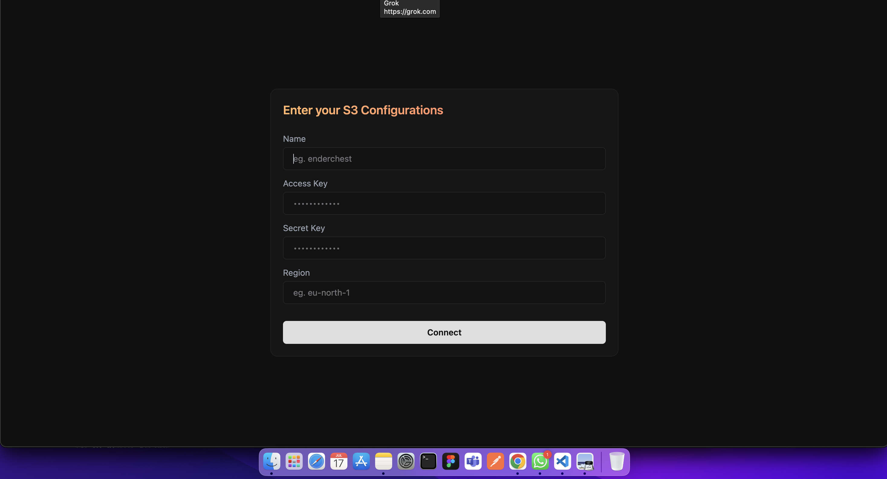
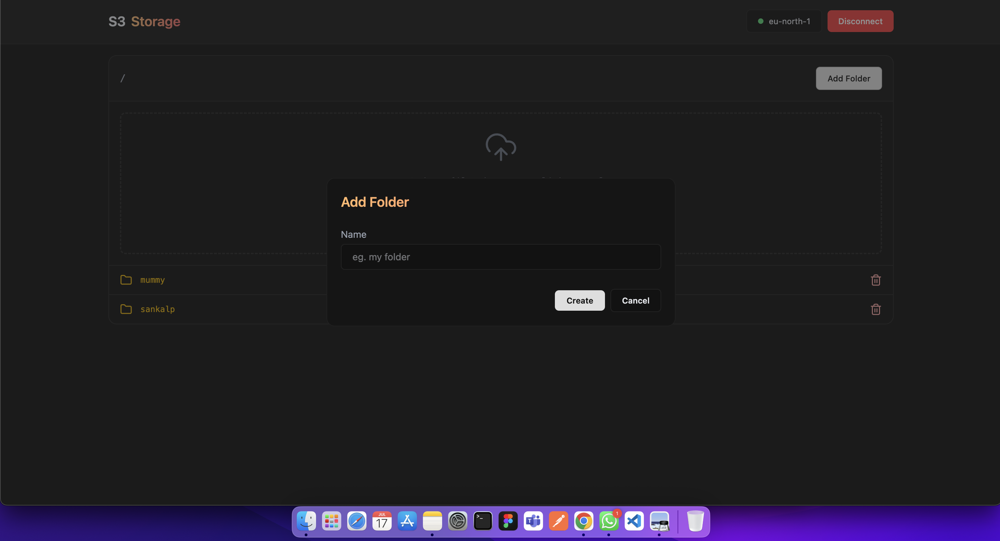
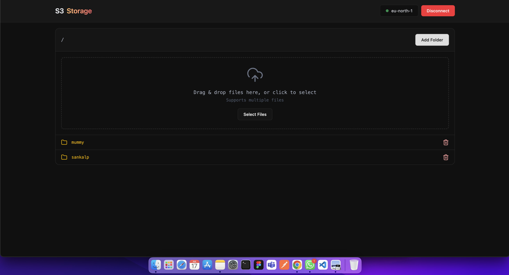
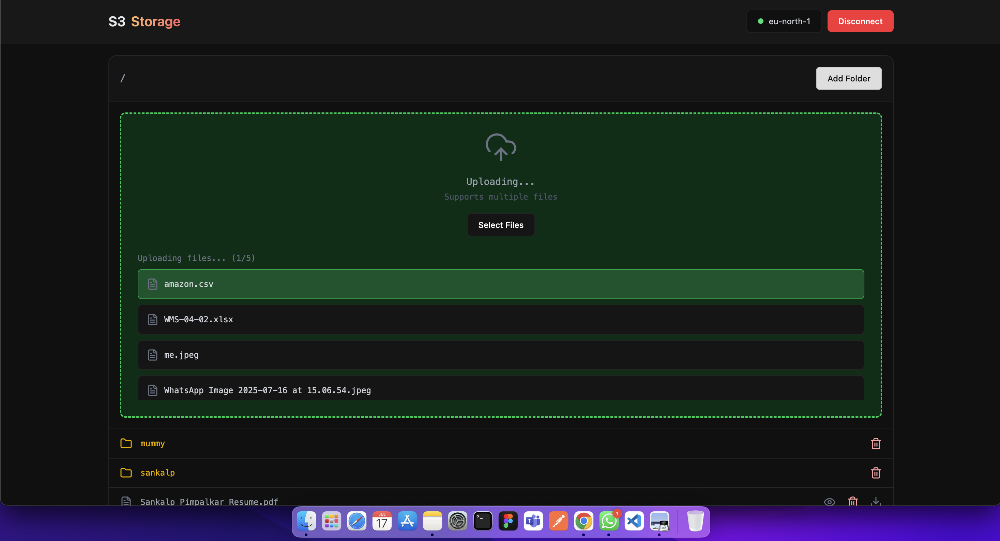
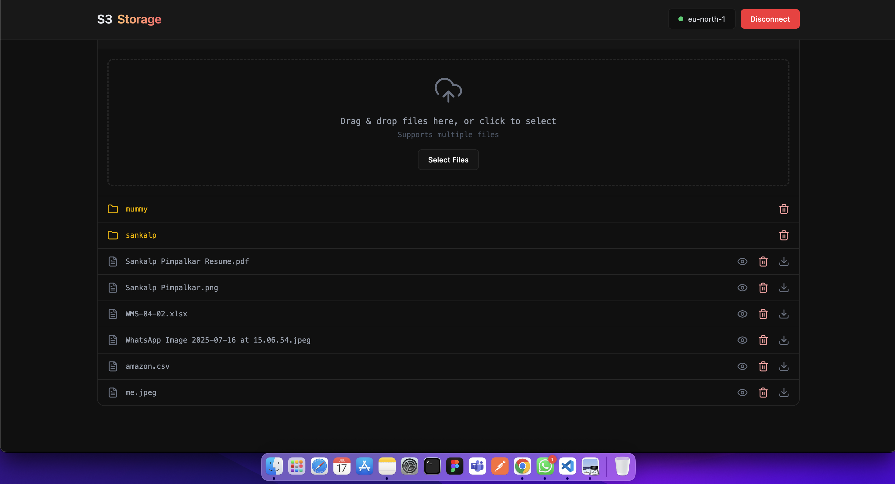

# 🚀 AWS S3 Storage Manager

A web-based tool to manage files and folders in your Amazon S3 bucket. Upload, preview, and organize your cloud storage seamlessly with a clean UI.

---

## ✨ Features

- 🔐 **Login Authentication** – Secure login with credentials.
- 📁 **Folder Management** – Create folders inside your S3 buckets.
- 📤 **File Uploading** – Upload large files directly to S3 with progress tracking.
- 🖼️ **File Preview** – Preview supported files (images, documents).
- 📊 **Result Display** – View upload results and errors clearly.

---

## 📸 Screenshots

### 🔐 Enter Credentials of your S3 Bucket


---

### 📁 You can add folders


---

### 🖼️ File Preview as File Manager Interface


---

### 📤 Supports Multiple Upload Files


---

### ✅ Result shows added files in specific location


---

## 🧰 Tech Stack

- **Frontend**: React
- **Storage**: Amazon S3
- **Authentication**: Credentials-based

---

## 🚀 Getting Started

1. Clone the repo:
   ```bash
   git clone https://github.com/SankalpPimpalkar/S3-Bucket-Storage-Manager.git

2. Install Dependencies
    ```bash
    npm install

3. Start Development Server
    ```bash
    npm run dev